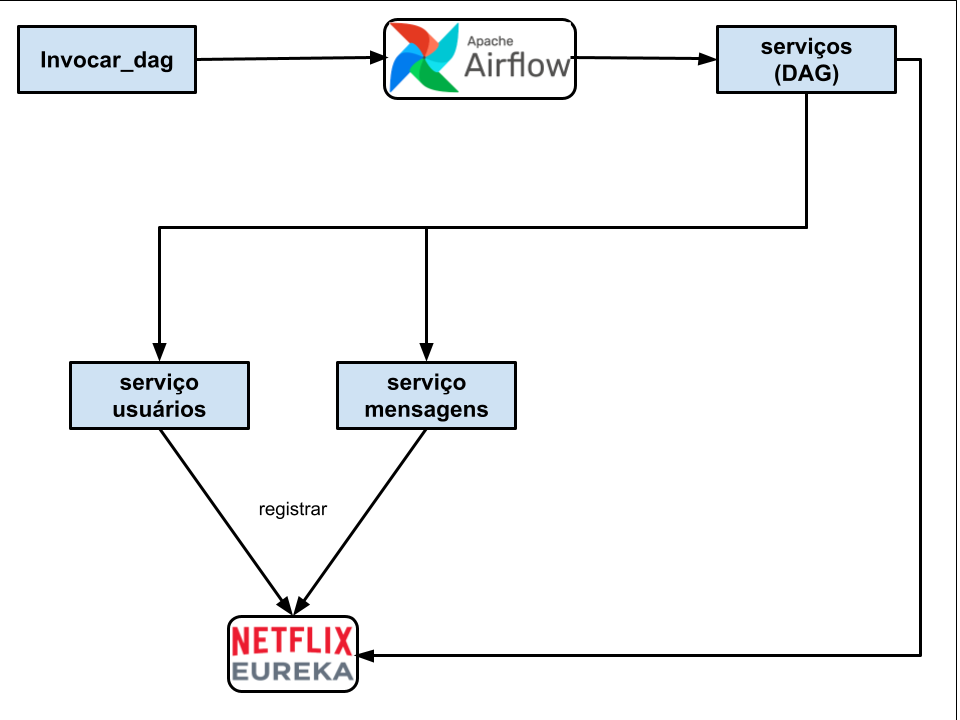
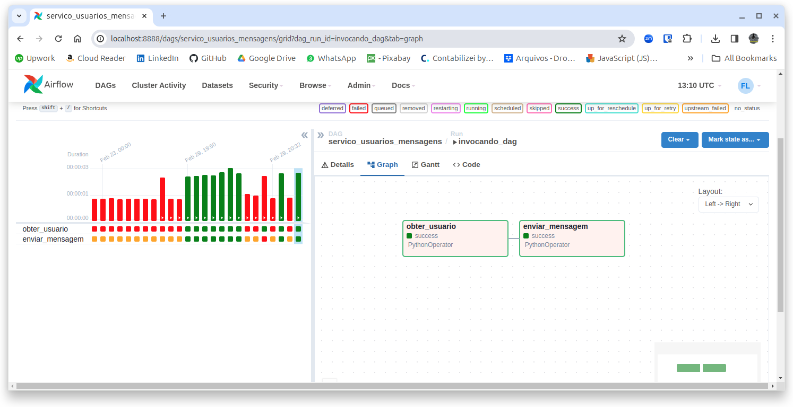
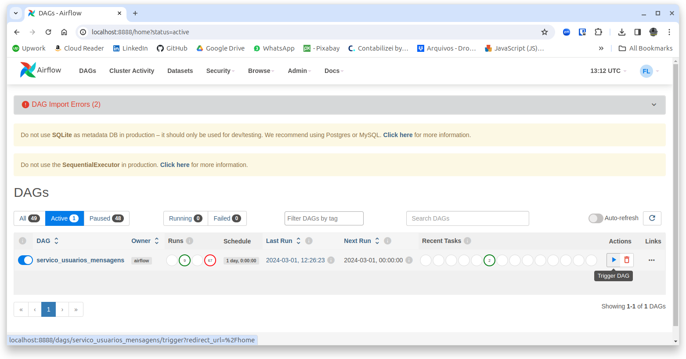
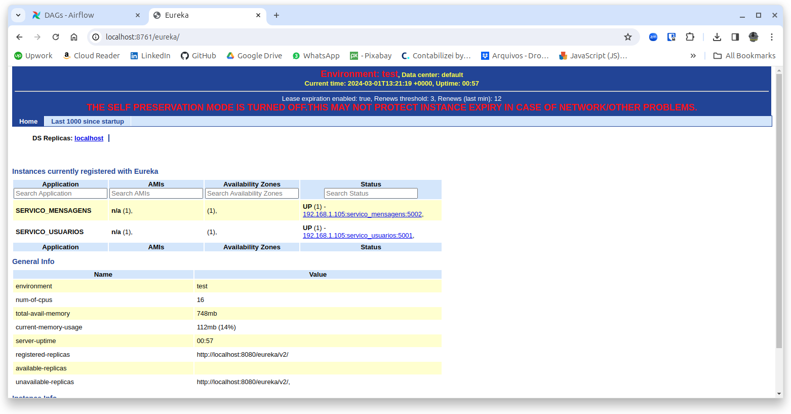

# Orquestração

Orquestração de **microsserviços** é um método utilizado para gerenciar, coordenar e organizar a interação entre serviços independentes em aplicações baseadas em microsserviços. Em sistemas complexos, onde diferentes microsserviços trabalham juntos para realizar funções de negócios, a orquestração é crucial para garantir que os processos sejam executados de maneira suave e eficiente. Aqui estão alguns pontos principais sobre a orquestração de microsserviços:

1. **Coordenação de Fluxos de Trabalho**: A orquestração gerencia como diferentes microsserviços interagem entre si para executar um processo ou fluxo de trabalho completo. Isso pode incluir a sequência de chamadas entre serviços, tratamento de dependências, e garantia de que os serviços sejam chamados na ordem correta.

2. **Gerenciamento de Dependências**: Em um ecossistema de microsserviços, diferentes serviços podem depender uns dos outros. A orquestração ajuda a gerenciar essas dependências, garantindo que os serviços estejam disponíveis e prontos para serem consumidos quando necessários.

3. **Balanceamento de Carga e Resiliência**: A orquestração pode ajudar a distribuir carga entre instâncias de serviços, melhorando a eficiência e a resiliência do sistema. Ela também pode lidar com falhas em serviços individuais, redirecionando solicitações ou reiniciando serviços conforme necessário.

4. **Automação de Implantação**: Ferramentas de orquestração frequentemente incluem capacidades para automatizar o processo de implantação de microsserviços, o que ajuda a garantir que as versões corretas dos serviços sejam implantadas em ambientes de produção, teste ou desenvolvimento.

5. **Descoberta de Serviços**: A orquestração de microsserviços geralmente envolve mecanismos de descoberta de serviços, permitindo que serviços se localizem e comuniquem entre si dinamicamente. Isso é crucial em ambientes onde os serviços podem ser escalados para cima ou para baixo frequentemente.

6. **Ferramentas e Plataformas**: Existem várias ferramentas e plataformas que suportam a orquestração de microsserviços, como Kubernetes, Docker Swarm, e Apache Mesos. Essas ferramentas fornecem frameworks para gerenciar contêineres, nos quais os microsserviços são frequentemente empacotados, permitindo uma orquestração eficaz em ambientes de nuvem ou on-premises.

A orquestração de microsserviços é um componente essencial para garantir que aplicações baseadas em microsserviços sejam escaláveis, confiáveis e fáceis de gerenciar. Ela permite que as equipes de desenvolvimento e operações maximizem os benefícios da arquitetura de microsserviços, como a capacidade de desenvolver, testar, implantar e escalar serviços independentemente.

## Ferramentas mais populares

Para orquestrar microsserviços eficazmente, diversas ferramentas são projetadas para endereçar os desafios específicos mencionados. Aqui estão algumas das ferramentas mais populares e como elas se aplicam a cada área:

### 1. Coordenação de Fluxos de Trabalho
- **Apache Airflow**: É uma plataforma open-source para programar e coordenar fluxos de trabalho complexos. Com Airflow, você pode definir, agendar e monitorar fluxos de trabalho como DAGs (Directed Acyclic Graphs), que são muito úteis para organizar a execução de tarefas dependentes em microsserviços.
- **Camunda**: Oferece uma plataforma para automação de processos de negócios, permitindo a modelagem, execução e monitoramento de fluxos de trabalho e decisões em ambientes de microsserviços.

### 2. Gerenciamento de Dependências
- **Consul**: Ferramenta de serviço de descoberta e configuração da HashiCorp que também oferece recursos para gerenciamento de saúde e dependências de serviços, permitindo que os microsserviços descubram e se comuniquem entre si de forma segura.
- **Spring Cloud**: Proporciona um conjunto de ferramentas para desenvolvedores de aplicações Java, incluindo recursos para gerenciamento de configurações, descoberta de serviços e circuit breakers para tratar dependências e falhas entre serviços.

### 3. Balanceamento de Carga e Resiliência
- **Kubernetes**: Além de ser uma plataforma de orquestração de contêineres, o Kubernetes oferece recursos integrados para balanceamento de carga, auto-reparo, escalabilidade automática e gerenciamento de configuração e segredos.
- **Istio**: Um service mesh que oferece uma camada de abstração para controlar o tráfego de rede entre microsserviços, fornecendo balanceamento de carga, resiliência (retry, circuit breaking) e monitoramento.

### 4. Automação de Implantação
- **Jenkins**: Uma plataforma de integração contínua e entrega contínua (CI/CD) que pode ser usada para automatizar a implantação de microsserviços, com pipelines configuráveis para diferentes ambientes.
- **GitLab CI/CD**: Oferece um sistema de CI/CD integrado ao repositório GitLab, permitindo a definição de pipelines de CI/CD como código, o que facilita a automação de implantação de microsserviços.

### 5. Descoberta de Serviços
- **Eureka**: Parte do Spring Cloud Netflix, é um serviço de descoberta para microsserviços, onde serviços podem registrar-se e localizar uns aos outros para facilitar a comunicação.
- **Zookeeper**: Embora originalmente projetado para coordenação entre nós em um sistema distribuído, o Apache Zookeeper é frequentemente usado para descoberta de serviços em arquiteturas de microsserviços, mantendo uma lista de serviços e suas instâncias.

Cada uma dessas ferramentas pode ser usada individualmente ou em conjunto para criar uma arquitetura de microsserviços robusta, escalável e resiliente. A escolha depende de vários fatores, incluindo os requisitos específicos do projeto, a familiaridade da equipe com a tecnologia, e o ecossistema tecnológico existente da organização.

## Service Discovery com NetflixOSS Eureka

Na aula anterior, criamos dois **microsserviços** que se invocavam utilizando **comunicação direta**. E um deles possuía a **URL** do outro. Isso é tão ruim quanto invocar uma função em uma **shared library**.

**Service discovery** é um componente importante em um sistema baseado em **Eventos**, cujos serviços se comunicam diretamente. E o **Eureka** pode resolver isso.

O Eureka é parte do Netflix Open Source Software Center (**NetflixOSS**), que engloba uma série de projetos de software aberto desenvolvidos pela Netflix para solucionar problemas específicos de escalabilidade, disponibilidade e desempenho em serviços baseados na nuvem.

Eureka é um serviço de descoberta para aplicações em microserviços. Isso significa que ele permite que os serviços se encontrem e se comuniquem na nuvem. É como um catálogo de endereços para serviços, onde cada serviço se registra no Eureka, tornando-se assim descobrível para outros serviços. Este processo é crucial em arquiteturas de microserviços, onde é comum ter muitos serviços pequenos e independentes que precisam se comunicar uns com os outros.

Principais características do Eureka incluem:

1. **Registro de Serviço e Descoberta**: Cada microserviço se registra no Eureka Server e, em seguida, pode usar o Eureka Client para descobrir outros serviços registrados. Isso facilita a comunicação entre serviços em uma arquitetura de microserviços.

2. **Balanceamento de Carga do Lado do Cliente**: O Eureka pode ser usado com o Ribbon, outro projeto NetflixOSS, para realizar balanceamento de carga do lado do cliente. Isso significa que o cliente escolhe qual instância de serviço chamar com base em informações de disponibilidade e saúde coletadas pelo Eureka.

3. **Design Resistente a Falhas**: O Eureka foi projetado para ser altamente disponível e resistente a falhas. Ele pode continuar operando mesmo que algumas de suas instâncias falhem.

4. **Suporte à Zonas de Disponibilidade**: O Eureka suporta a execução em múltiplas zonas de disponibilidade, aumentando a resiliência e disponibilidade dos serviços registrados.

O Eureka é amplamente utilizado na comunidade de desenvolvimento de software e é uma peça-chave em muitas arquiteturas de microserviços, especialmente aquelas que rodam na nuvem. A capacidade de descobrir dinamicamente serviços em um ambiente em constante mudança é um dos principais benefícios de usar o Eureka.

Nessa aula, vamos utilizar o Eureka rodando em um **Contêiner** **Docker**. Para isto, você precisa rodar o comando: 
```shell
docker run -d --name eureka -p 8761:8080 netflixoss/eureka:1.3.1
```

E precisa configurar seus serviços para se registrarem no **Eureka**. No nosso exemplo eu mostro como fazer isso: 
```python
import py_eureka_client.eureka_client as eureka_client
...
# Registrar o serviço no Eureka:
eureka_client.init(eureka_server="http://localhost:8761/eureka/v2",
                   app_name="servico_mensagens",
                   instance_port=5002)
...
```

É importante passar o nome do serviço e a porta desejada. 

Para executar um serviço utilizando o Eureka tem um exemplo (**teste.py**) que mostra isso: 
```python
import json
from py_eureka_client import eureka_client

def enviar(): 
    eureka_client.init(eureka_server="http://localhost:8761/eureka/v2",
                   app_name="servico_mensagens",
                   instance_port=5002)
    mensagem = {"usuario_id": 1, "grupo": "grupo1", "mensagem": "Mensagem automática do Airflow"}
    response = eureka_client.do_service("servico_mensagens", "/enviar_mensagem", headers={"Content-type":"application/json"},method="POST", data=json.dumps(mensagem)) 
    print(response)

if __name__ == "__main__":
    enviar()
```

O método **do_service** descobre o serviço e já invoca. Pode utilizar **GET** ou **POST**. 

## Apache Airflow

De acordo com sua documentação, o **Apache Airflow** é uma plataforma de código aberto para desenvolvimento, agendamento e monitoramento de fluxos de trabalho orientados em lote. A estrutura Python extensível do Airflow permite criar fluxos de trabalho conectados a praticamente qualquer tecnologia. Uma interface web ajuda a gerenciar o estado dos seus fluxos de trabalho. O Airflow pode ser implantado de várias maneiras, variando desde um único processo em seu laptop até uma configuração distribuída para oferecer suporte até mesmo aos maiores fluxos de trabalho.

O Apache Airflow coordena e monitora fluxos de trabalho ou workflows, e é uma das ferramentas mais utilizadas para **orquestração** de microsserviços. Ele usa scripts Python para criar **DAGs** (Directed Acyclic Graphs), que definem conjuntos de tarefas e suas dependências. Embora o Airflow possa ser executado em um ambiente de servidor para gerenciar e orquestrar tarefas em larga escala, ele também pode ser executado localmente para desenvolvimento e testes. Aqui está um guia básico de como você pode rodar o DAG proposto com o Airflow.

### Pré-requisitos

- Python instalado em sua máquina.
- Ambiente virtual Python (opcional, mas recomendado).

### Instalação do Airflow

1. **Crie e ative um ambiente virtual Python (opcional):**

   ```bash
   python -m venv airflow_venv
   source airflow_venv/bin/activate  # No Windows use `airflow_venv\Scripts\activate`
   ```

2. **Instale o Apache Airflow:**

   - É recomendado especificar a constraint de versão do Airflow para evitar incompatibilidades. A versão do constraint deve corresponder à sua versão do Airflow.

   ```bash
   pip install apache-airflow==2.8.2 --constraint "https://raw.githubusercontent.com/apache/airflow/constraints-2.8.2/constraints-3.8.txt"
   ```

### Configuração do Airflow

1. **Inicialize o banco de dados do Airflow:**

   ```bash
   airflow db init
   ```

2. **Crie um usuário para acessar a interface web:**

   ```bash
   airflow users create \
       --username admin \
       --firstname FIRST_NAME \
       --lastname LAST_NAME \
       --role Admin \
       --email admin@example.com

   # Use a password: teste 
   ```

3. **Inicie a interface web do Airflow:**

   ```bash
   airflow webserver --port 8888
   ```

   Depois de iniciar o servidor web, você pode acessar a interface do Airflow em `http://localhost:8080` usando o navegador.

4. **Em um novo terminal, inicie o scheduler do Airflow:**

   ```bash
   airflow scheduler
   ```

   O scheduler é responsável por executar suas tarefas com base no agendamento e dependências definidas em seus DAGs.

### Rodando o DAG

Para rodar o DAG que propus:

1. **Coloque o código do DAG em um arquivo Python dentro do diretório `dags`** do seu ambiente Airflow. Por padrão, este diretório está localizado em `~/airflow/dags`.

2. **Verifique se o DAG aparece na interface web do Airflow.** Você deve ser capaz de ver o DAG listado na interface web após alguns minutos. Se não aparecer, verifique se o scheduler está rodando e se não há erros no código do DAG.

3. **Ative o DAG na interface web.** DAGs podem ser ativados ou desativados através da interface web. Uma vez ativado, o Airflow começará a executar as tarefas do DAG com base no seu agendamento e dependências.

### Nota

O Airflow é uma ferramenta poderosa que oferece muitas configurações e opções. Dependendo da complexidade de seus fluxos de trabalho e do ambiente de execução, pode ser necessário realizar configurações adicionais, como definir conexões para bancos de dados externos, configurar pools de execução, entre outras. A documentação oficial do Airflow é um excelente recurso para explorar todas as capacidades da plataforma.

## Demonstração

Vamos criar uma demonstração com os mesmos serviços que utilizamos na aula anterior. Para isto, teremos que fazer algumas adaptações. Veja neste diagrama como vai funcionar: 



O **servico_mensagens** não mais invocará o **servico_usuarios** para saber se um usuário pode enviar mensagem para um grupo. Esse controle passará a ser do **orquestrador**, que é o arquivo **DAG** (em **Python**).

### Alterações nos dois microsserviços

Ambos os serviços se registrarão no **Eureka** assim que subirem, permitindo que sejam **descobertos** por quem necessitar deles. O código já foi mostrado anteriormente e você pode ver na pasta que baixou do curso. 

### Criação do DAG

Vamos criar um **orquestrador** que o **Airflow** executará quando invocado. Esse orquestrador é um código **Python** e é conhecido como Directed Acyclic Graphs ou **DAG**. O arquivo **servicos.py**, localizado na pasta do curso, é este DAG. Ele deve ser copiado para sua pasta **HOME** ("**~/airflow/dags**")

O que faz um **DAG**? Ele começa declarando que é um **DAG** e configurando os argumentos e parâmetros que recebe: 
```python
...
default_args = {
    'owner': 'airflow',
    'start_date': datetime(2024, 1, 1),
    'retry_delay': timedelta(minutes=1),
}

dag = DAG('servico_usuarios_mensagens',
          default_args=default_args,
          params={"usuario_id": Param(1, type="integer", minimum=1)},
          description='Consulta usuário e envia mensagem',
          schedule_interval=timedelta(days=1))
usuario_id="{{ dag_run.conf['usuario_id'] }}"
...
```

O nome do **DAG** ("servico_usuarios_mensagens") é muito importante, pois é assim que ele aparecerá na console do **Airflow**. Note que esta DAG recebe um **parâmetro** chamado **usuario_id**, do tipo **inteiro**, com valor inicial 1 e tamanho mínimo de 1. Depois, eu pego nas configurações de execução do DAG esse parâmetro. 

A próxima coisa que o DAG faz é declarar as **tarefas** (**tasks**) que ele irá executar: 
```python
...
t1 = PythonOperator(
    task_id='obter_usuario',
    python_callable=obter_usuario,
    op_kwargs={'usuario_id': usuario_id},
    dag=dag,
)

t2 = PythonOperator(
    task_id='enviar_mensagem',
    python_callable=enviar_mensagem,
    dag=dag,
)
...
```

A classe **PythonOperator** declara uma task e pode conter, além do **task_id**, parâmetros para a task, passado por **op_kwargs**. Eu passo para a task **obter_usuario** o **usuario_id** que o **DAG** recebeu. 

Finalmente, temos as dependências entre as tasks, que indica como elas serão executadas: 
```python
t1 >> t2
```

Vemos que a task "**enviar_mensagem**" depende da task "**obter_usuario** e isso pode ser visto no gráfico do Airflow: 




### Na console do Airflow

Se abriros o site do [**Airflow: localhost:8888**](http://localhost:8888) veremos a console do **Airflow**, de onde podemos executar **DAGs** ou ver **logs** etc: 



É só clicar no botão **trigger DAG** para executar o **DAG**. Antes, ele pedirá o valor do parâmetro **usuario_id**. 

### Invocando o DAG por fora

Você não vai querer invocar os workflows utilizando a console do Airflow, certo? Afinal, você tem um sistema baseado em **Eventos** é quer invocar cada workflow de dentro dos seus serviços de negócio, não é mesmo? Então, você pode invocar um DAG como eu faço no **invocar_dag**: 
```python
from airflow.api.client.local_client import Client

c = Client(None, None)
c.trigger_dag(dag_id='servico_usuarios_mensagens', run_id='invocando_dag', conf={'usuario_id':1})
```

Só isso! Eu nem preciso saber quais microsserviços serão invocados, ou a sua ordem ou mesmo as suas pré-condições. Só preciso passar o nome do DAG e os parâmetros que ele requer, neste caso, o **usuario_id**.

Essa é a beleza da **orquestração**. Temos um ponto central que coordena a execução de **workflows** para nós. 

## Como executar a demonstração

1) Suba uma instância do **Eureka**
```shell
docker rm -f $(docker ps -q -a)
docker run -d --name eureka -p 8761:8080 netflixoss/eureka:1.3.1
```
2) Suba uma instância de cada serviço (**servico_usuarios** e **servico_mensagens**). Pode até abrir a [console do **Eureka**](http://localhost:8761/eureka) para ver isso.



3) Suba o **airflow webserver** (em uma janela **terminal** separada): 
```shell
airflow webserver --port 8888
```
4) Inicie o **scheduler** do Airflow: 
```shell
airflow scheduler
```

Agora, você pode usar a [**console do airflow**](http://localhost:8888) para executar o **DAG** ou pode simplesmente rodar o arquivo **invocar_dag.py**: 
```shell
$ python invocar_dag.py
```

Se olhar o terminal onde o **servico_mensagens** está sendo executado, verá no log: 
```shell
* Debug mode: on
WARNING: This is a development server. Do not use it in a production deployment. Use a production WSGI server instead.
 * Running on all addresses (0.0.0.0)
 * Running on http://127.0.0.1:5002
 * Running on http://192.168.1.105:5002
Press CTRL+C to quit
 * Restarting with stat
 * Debugger is active!
 * Debugger PIN: 358-794-304
Mensagem enviada para o grupo 'admin': Mensagem automática do Airflow
127.0.0.1 - - [01/Mar/2024 09:26:27] "POST /enviar_mensagem HTTP/1.1" 200 -
```

Para terminar o Airflow Webserver basta fechar a janela ou então: 
```shell
kill $(ps -o ppid= -p $(cat ~/airflow/airflow-webserver.pid))
```
